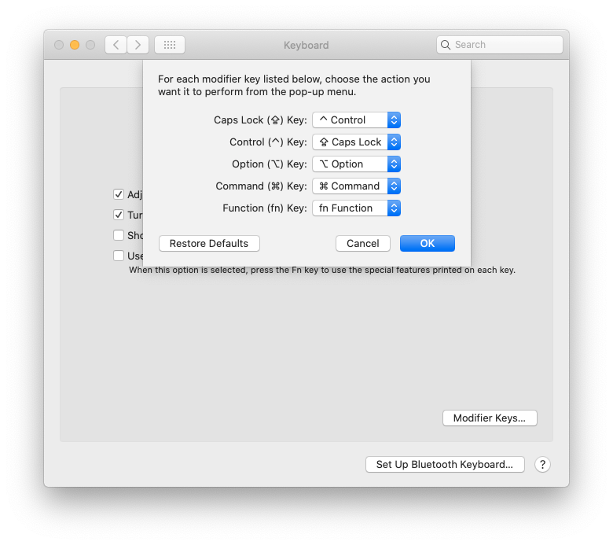

# Getting Started with Vim

Vim is a highly configurable text editor built to make creating and changing
any kind of text very efficient. It is included as "vi" with most UNIX systems
and with Apple OS X.

## General Advice

### Not Just an Editor

One of the things I've heard people say about Vim is that it has like thousands
of shortcuts. Vim is not about memorizing typical shortcuts like
<kbd>ctrl</kbd>+<kbd>z</kbd> to undo. There's a language that you need to learn
in order to use this editor efficiently. It has its own grammar. There are
numerous talks that emphasize this fact.
[Here](https://youtu.be/wlR5gYd6um0)'s one.

It is similar to learning a new language. A language you'll use to command your
editor. Without the mouse, you might feel handicapped, but in the long run,
you'll be far more efficient at editing text than you could ever be with a
mouse.

I find myself speaking `?self⏎cibcls` sometimes.

### Staying Normal

As soon as you're done typing, exit the insert mode and enter the normal mode.
If you don't, something like
```c
int push(Stack* stack,ci()
                      ^^^
```
might happen.

### Caps Lock to Control

Map <kbd>CAPS</kbd> to <kbd>ctrl</kbd> and use <kbd>ctrl</kbd>+<kbd>[</kbd> to send an <kbd>Esc</kbd>.

I had a fancier mapping with Karabiner Elements (macOS only application) where
<kbd>CAPS</kbd> acted as <kbd>Esc</kbd> when pressed alone, but as <kbd>ctrl</kbd> when pressed with any
other key. It is not easy to configure on other OS's, unlike mapping <kbd>CAPS</kbd> to
<kbd>ctrl</kbd>. Since I was switching between machines, that amount of ease on one
machine was not worth overcoming the adaptivity issues.

This will make most of the <kbd>ctrl</kbd> bindings painless. You might wonder how you
can make your text SCREAM, but there's <kbd>g</kbd> <kbd>U</kbd>.

#### Linux

There are numerous ways to do this. You might have to do some research for your
specific case. I have
```
exec_always --no-startup-id /usr/bin/setxkbmap -option "ctrl:nocaps"
```
in my i3 config.

#### macOS

Easily doable in the **Modifier Keys...** section available under **Keyboard**
Preferences.



#### Windows

[PowerToys](https://github.com/microsoft/PowerToys/releases) has a Keyboard
Manager that allows you to do this.
